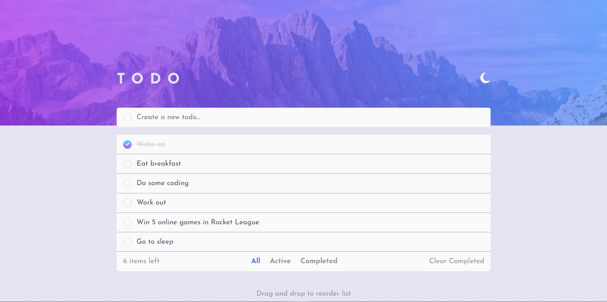
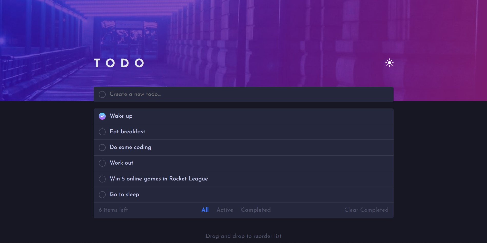
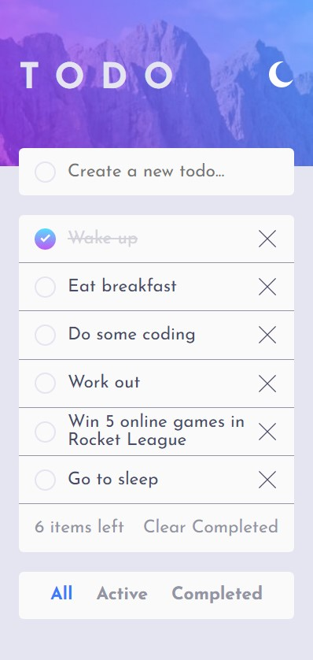
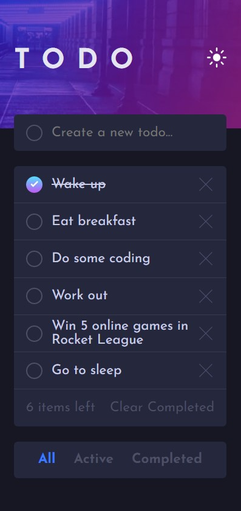

# Frontend Mentor - Todo app solution

This is a solution to the [Todo app challenge on Frontend Mentor](https://www.frontendmentor.io/challenges/todo-app-Su1_KokOW). Frontend Mentor challenges help you improve your coding skills by building realistic projects.

## Table of contents

- [Overview](#overview)
  - [The challenge](#the-challenge)
  - [Screenshot](#screenshot)
  - [Links](#links)
- [My process](#my-process)
  - [Built with](#built-with)
  - [What I learned](#what-i-learned)
  - [Continued development](#continued-development)
  - [Useful resources](#useful-resources)
- [Author](#author)

## Overview

### The challenge

Users should be able to:

- View the optimal layout for the app depending on their device's screen size
- See hover states for all interactive elements on the page
- Add new todos to the list
- Mark todos as complete
- Delete todos from the list
- Filter by all/active/complete todos
- Clear all completed todos
- Toggle light and dark mode
- **Bonus**: Drag and drop to reorder items on the list

### Screenshot

### Links

- Live Site URL: [https://sw-todo.netlify.app](https://sw-todo.netlify.app)

## My process

### Built with

- Semantic HTML5 markup
- CSS custom properties
- Flexbox
- Mobile-first workflow
- [React](https://reactjs.org/) - JS library

### What I learned

While making this project, I learned how to:

- recreate a design from a mockup,
- use the [Drag-and-Drop API](https://developer.mozilla.org/en-US/docs/Web/API/HTML_Drag_and_Drop_API),
- save data across sessions using the Local Storage in the [Web Storage API](https://developer.mozilla.org/en-US/docs/Web/API/Web_Storage_API).
- utilize an external library to solve a problem within reasonable time (I used [mobile-drag-drop](https://github.com/timruffles/mobile-drag-drop) to efficiently make my drag-and-drop code work on mobile devices instead of spending much more time to learn to solve the problem using [Touch events](https://developer.mozilla.org/en-US/docs/Web/API/Touch_events)), and
- create a light/dark mode toggle.

### Continued development

After working on this project, I realized the usefulness of mobile-first development. It is easier to design and style a website using this approach in my opinion, so I will continue to use this approach in the future. Also, I will likely continue to use Javascript frameworks like React when making a web app because seperating the logic and design into various reusable components is beneficial for focusing on a single part at a time while developing or maintaining. One last improvement that I could make in my workflow is making more commits. During this project and before, I made a lot of progress before commiting changes. In the future, I plan to make commits after smaller changes.

### Useful resources

- [Web Storage API Documentation](https://developer.mozilla.org/en-US/docs/Web/API/Web_Storage_API) - Until this project, I never knew how to store user data on their device. This documentation helped me learn how to use Local Storage to save a user's data across sessions.
- [Drag-and-Drop API](https://developer.mozilla.org/en-US/docs/Web/API/HTML_Drag_and_Drop_API) - A bonus task for this front-end-mentor project was to allow users to drag and drop todos to change their order. I did not initially know how to do this, but this documentation (and the respective examples) gave me all the help I needed to solve this problem.
- [mobile-drag-drop](https://github.com/timruffles/mobile-drag-drop) - Once I realized that the Drag-And-Drop API did not work on mobile browsers and that Touch events did not work the same way as the drag-and-drop API, I was annoyed and stumped about how to solve my problem. This shim allowed my code to work almost perfectly (I found some problems in Firefox Mobile) across platforms with minimal extra code.

## Author

- Website - [Stevon Wright](https://stevon-wright.netlify.app)
